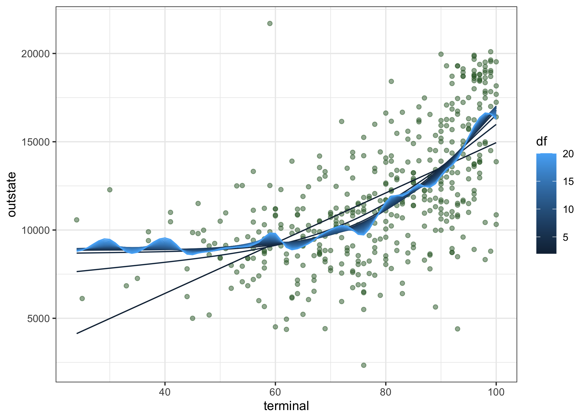
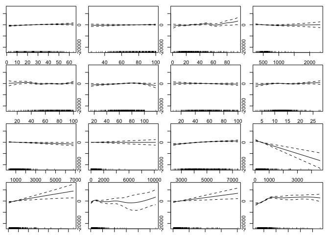
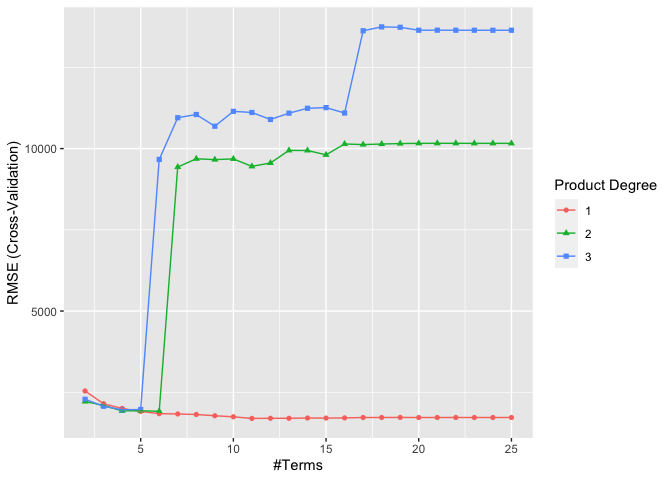
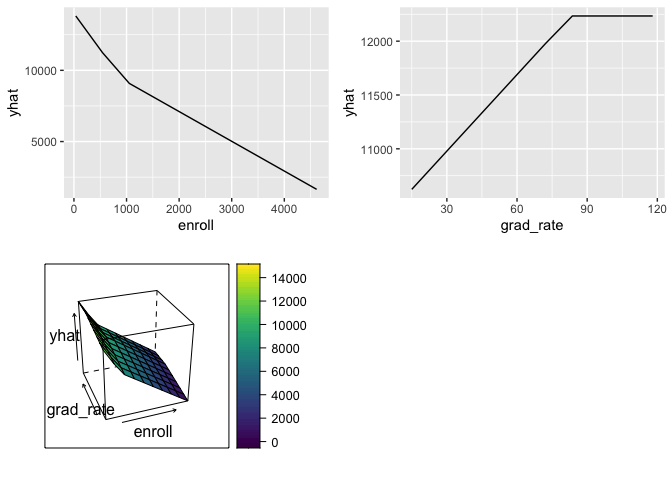
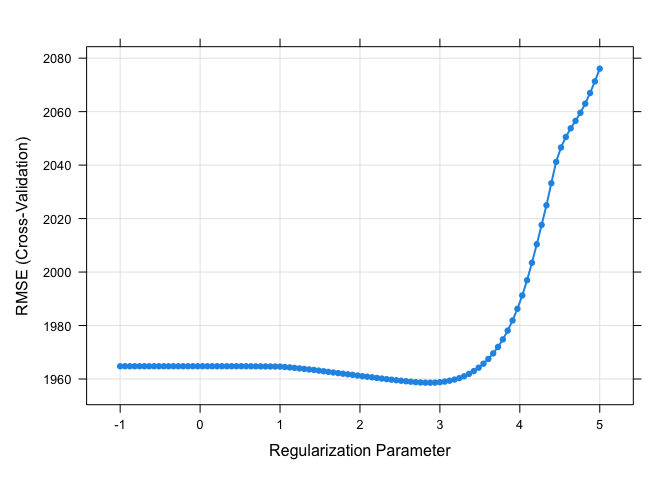
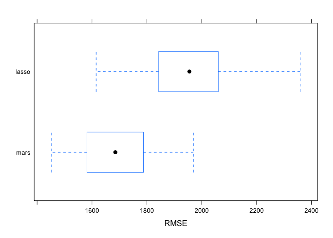

P8106 HW2
================
Lin Yang

``` r
library(caret) 
library(splines)
library(mgcv)
library(pdp)
library(earth)
library(tidyverse)
library(glmnet)
```

## Partition the dataset into training data and test data

``` r
College <- read.csv("data/College.csv") %>% 
  janitor::clean_names() %>% 
  select(-1) #delete the column of college

set.seed(2022)
trainRows <- createDataPartition(y = College$outstate, p = 0.8, list = FALSE)
College_train <- College[trainRows, ]
College_test <- College[-trainRows, ]
```

## EDA

``` r
x_train <- model.matrix(outstate ~ ., College_train)[ , -1]
y_train <- College_train$outstate

x_test <- model.matrix(outstate ~ ., College_test)[ , -1]
y_test <- College_test$outstate

theme1 <- trellis.par.get()
theme1$plot.symbol$col <- rgb(.2, .4, .2, .5)
theme1$plot.symbol$pch <- 16
theme1$plot.line$col <- rgb(.8, .1, .1, 1)
theme1$plot.line$lwd <- 2
theme1$strip.background$col <- rgb(.0, .2, .6, .2)
trellis.par.set(theme1)

#scatterplots of outstate vs predictors
featurePlot(x_train, y_train, 
            plot = "scatter", 
            labels = c("","Outstate"),
            type = c("p"), 
            layout = c(4, 4))
```

<!-- -->

``` r
#correlation plot of preditors
corrplot::corrplot(cor(x_train), 
         method = "circle", 
         type = "full",
         tl.cex = 0.5)
```

<!-- -->

Based on the scatter plots of Outstate vs predictors, we can see that
there are possible linear relationships between the response `outstate`
and predictors, `top25perc`, `room_board`, `top10perc`, and `expend`.
And according to the correlation plot, some variables are highly
correlated, such as `apps` and `accept`, `enroll` and `f_undergrad`,
`top25perc` and `top10perc`.

## Fit smoothing spline models using Terminal only

``` r
fit.ss <- smooth.spline(College_train$terminal, College_train$outstate)
#degree of freedom
fit.ss$df
```

    ## [1] 4.364545

``` r
#range of terminal values
range(College_train$terminal)
```

    ## [1]  24 100

``` r
#grid of terminal values
terminal.grid <- seq(from = 24, to = 100, by = 1)
#predictions on grid of terminal values
pred.ss <- predict(fit.ss, x = terminal.grid)

pred.ss.df <- data.frame(pred = pred.ss$y, terminal = terminal.grid)

p <- ggplot(data = College_train, aes(x = terminal, y = outstate)) +
     geom_point(color = rgb(.2, .4, .2, .5))

p + geom_line(aes(x = terminal, y = pred), data = pred.ss.df, color = rgb(.8, .1, .1, 1)) + theme_bw()
```

<!-- -->

The degree of freedom obtained by generalized cross-validation is
4.3645446. The plot of the smoothing spline model with optimized GCV df
seems to fit the data well. It follows the data trend without under or
over fitting. We then fit smoothing spline models with a range of
degrees of freedom.

``` r
#a smoothing spline function of df
ss <- function(df) {
  fit.ss <- smooth.spline(College_train$terminal, College_train$outstate, df = df)
  pred.ss <- predict(fit.ss, x = terminal.grid)
  pred.ss.df <- data.frame(pred = pred.ss$y, terminal = terminal.grid, df = df)
  return(pred.ss.df)
}

#create a list to store for loop results
ss_list <- list()

for (i in 2:20) {
  res <- ss(i)
  ss_list[[i]] <- res
}

#convert the result list to a data frame
res_df <- bind_rows(ss_list, .id = "list_label") %>% 
          as.data.frame() %>% 
          select(-1)

p + geom_line(aes(x = terminal, y = pred, group = df, color = df), 
              data = res_df) + 
  theme_bw()
```

<!-- -->

The plot of smoothing spline models with varying degrees of freedom
shows that the model with larger df are more flexible. The linear curve
should have the smallest df. Other darker curves represent slightly
flexible models with small df. The light blue curve with highest df
seems quite flexible across data points.

## GAM

``` r
ctrl <- trainControl(method = "cv", number = 10)
set.seed(2022)
fit.gam <- train(x_train, y_train,
                 method = "gam",
                 tuneGrid = data.frame(method = "GCV.Cp", select = c(TRUE,FALSE)),
                 trControl = ctrl)

fit.gam$bestTune
```

    ##   select method
    ## 1  FALSE GCV.Cp

``` r
fit.gam$finalModel
```

    ## 
    ## Family: gaussian 
    ## Link function: identity 
    ## 
    ## Formula:
    ## .outcome ~ s(perc_alumni) + s(terminal) + s(top10perc) + s(books) + 
    ##     s(ph_d) + s(grad_rate) + s(top25perc) + s(s_f_ratio) + s(personal) + 
    ##     s(p_undergrad) + s(room_board) + s(enroll) + s(accept) + 
    ##     s(f_undergrad) + s(apps) + s(expend)
    ## 
    ## Estimated degrees of freedom:
    ## 1.75 1.00 7.93 1.95 5.71 3.92 1.34 
    ## 3.60 1.00 1.00 2.21 1.00 1.33 6.52 
    ## 1.00 6.17  total = 48.42 
    ## 
    ## GCV score: 2657691

``` r
#plot of final model
par(mar=c(1,1,1,1))
par(mfrow = c(4, 4))
plot(fit.gam$finalModel)
```

<!-- -->

``` r
#test error
gam_test_mse <- mean((y_test - predict(fit.gam, x_test))^2)
gam_test_mse
```

    ## [1] 3494520

According to the final GAM model, all predictors are shown to be
nonlinear since they all have `s()` in the model. However, predictors
`terminal`, `personal`, `p_undergrad`, `enroll`, and `apps` have
estimated degree of freedom of 1, meaning these predictors have linear
relationship with the outcome. Other predictors have estimated degrees
of freedom greater than 1, indicating their nonlinear relationship with
the outcome. This can be explained by the fact that in caret, variables
with more than 10 unique values are considered for nonlinearity, whereas
variables with less than 10 unique values are forced to be linear. In
this dataset, all variables have more than 10 unique values. We also
calculate the test MSE of this GAM model to be 3.4945204^{6}.

## MARS

``` r
#tuning parameter grid
mars_grid <- expand.grid(degree = 1:3,
                         nprune = 2:25)

set.seed(2022)
fit.mars <- train(x_train, y_train,
                  method = "earth",
                  tuneGrid = mars_grid,
                  trControl = ctrl)

ggplot(fit.mars)
```

<!-- -->

``` r
fit.mars$bestTune
```

    ##    nprune degree
    ## 10     11      1

``` r
coef(fit.mars$finalModel)
```

    ##         (Intercept)     h(16262-expend)  h(5620-room_board) h(1365-f_undergrad) 
    ##       15638.7944981          -0.5953777          -0.8472446          -1.7238957 
    ##   h(32-perc_alumni)        h(apps-1422)       h(enroll-911)       h(911-enroll) 
    ##         -43.8939153           0.4775894          -2.0881562           5.0659210 
    ##     h(83-grad_rate)    h(1323-personal)      h(1228-accept) 
    ##         -23.6886814           0.9139770          -2.3199641

``` r
#test error
mars_test_mse <- mean((y_test - predict(fit.mars, x_test))^2)
mars_test_mse
```

    ## [1] 3780172

The plot of RMSE vs \# of terms shows that product degree of 1 and 11
terms achieve the lowest RMSE, which is the same as the results of the
fit’s bestTune. The coefficients of the final model is shown above. Note
that the numbers along with variable names are the location of knots.
The test MSE of the final MARS model is calculated to be 3.7801717^{6}.

To further understand the relationship between 2 particular variables
`enroll` and `grad_rate`, we create partial dependence plots for each
variable individually and an interaction PDP.

``` r
p1 <- pdp::partial(fit.mars, 
                   pred.var = c("enroll"), 
                   grid.resolution = 10) %>% autoplot()

p2 <- pdp::partial(fit.mars, 
                   pred.var = c("grad_rate"), 
                   grid.resolution = 10) %>% autoplot()

p3 <- pdp::partial(fit.mars, 
                   pred.var = c("enroll", "grad_rate"), 
                   grid.resolution = 10) %>%
      pdp::plotPartial(levelplot = FALSE, zlab = "yhat", drape = TRUE, 
                       screen = list(z = 20, x = -60))

grid.arrange(p1, p2, p3, ncol = 2)
```

<!-- -->

From the partial dependence plots, we see that variable `enroll` has a
knot around 1000, and `grad_rate` has a knot at 83, which corresponds to
coefficient summary above. For `enroll`, an unit increase in enroll will
cause a less sharp decrease in `outstate` if a college exceeds 1000 on
enroll. For `grad_rate`, when a college exceeds 83 on grad\_rate, the
response variable will remain the same. And a hinged surface of `enroll`
and `grad_rate` is shown above.

## Compare MARS model to linear model

``` r
#lasso
set.seed(2022)

fit.lasso <- train(x_train, y_train,
                   method = "glmnet",
                   tuneGrid = expand.grid(alpha = 1, 
                                          lambda = exp(seq(5, -1, length = 100))),
                   trControl = ctrl,
                   preProcess = c("center", "scale"))
plot(fit.lasso, xTrans = log, col = 4)
```

<!-- -->

``` r
fit.lasso$bestTune
```

    ##    alpha   lambda
    ## 65     1 17.79269

``` r
coef(fit.lasso$finalModel, fit.lasso$bestTune$lambda)
```

    ## 17 x 1 sparse Matrix of class "dgCMatrix"
    ##                      s1
    ## (Intercept) 11851.63135
    ## apps            .      
    ## accept       1560.11381
    ## enroll      -1380.78104
    ## top10perc     662.45497
    ## top25perc       .      
    ## f_undergrad   -51.31904
    ## p_undergrad  -167.62041
    ## room_board   1059.69524
    ## books           .      
    ## personal     -269.96211
    ## ph_d          117.75696
    ## terminal      359.60486
    ## s_f_ratio     -88.45766
    ## perc_alumni   510.14347
    ## expend        795.42854
    ## grad_rate     335.98151

The best tuning parameter lambda of this lasso model is 17.7926932. From
the coefficients above, we can see that predictors `apps`, `top25perc`,
and `books` are removed.

We then compare MARS and LASSO models using cross-validation RMSE to
determine which model does a better job in predicting the response
variable.

``` r
set.seed(2022)
resamp <- resamples(list(mars = fit.mars, lasso = fit.lasso))
summary(resamp)
```

    ## 
    ## Call:
    ## summary.resamples(object = resamp)
    ## 
    ## Models: mars, lasso 
    ## Number of resamples: 10 
    ## 
    ## MAE 
    ##           Min.  1st Qu.   Median     Mean  3rd Qu.     Max. NA's
    ## mars  1142.547 1234.655 1305.630 1309.620 1398.436 1444.893    0
    ## lasso 1276.703 1478.168 1620.191 1568.918 1653.074 1792.306    0
    ## 
    ## RMSE 
    ##           Min.  1st Qu.   Median     Mean  3rd Qu.     Max. NA's
    ## mars  1452.813 1593.318 1685.091 1695.013 1768.992 1969.314    0
    ## lasso 1615.145 1869.474 1955.018 1958.604 2036.788 2358.661    0
    ## 
    ## Rsquared 
    ##            Min.   1st Qu.    Median      Mean   3rd Qu.      Max. NA's
    ## mars  0.6959966 0.7726098 0.8086001 0.7896665 0.8197000 0.8435174    0
    ## lasso 0.6052682 0.6768264 0.7476490 0.7183039 0.7596034 0.8178313    0

``` r
bwplot(resamp, metric = "RMSE")
```

<!-- -->

Based on the boxplots, we prefer the MARS model because it has lower
median and mean cross-validation RMSE, suggesting that the MARS model
does better in predictions.
