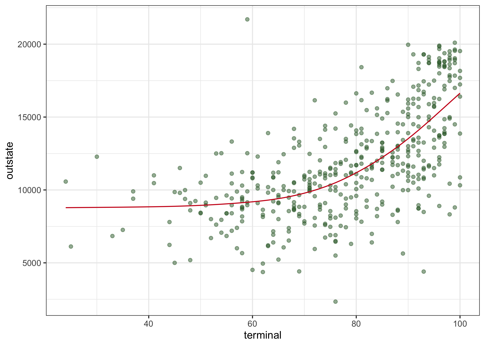

P8106 HW2
================
Lin Yang

``` r
library(caret) 
library(splines)
library(mgcv)
library(pdp)
library(earth)
library(tidyverse)
```

## Partition the dataset into training data and test data

``` r
College <- read.csv("data/College.csv") %>% 
  janitor::clean_names() %>% 
  select(-1) #delete the column of college

set.seed(2022)
trainRows <- createDataPartition(y = College$outstate, p = 0.8, list = FALSE)
College_train <- College[trainRows, ]
College_test <- College[-trainRows, ]
```

## EDA

``` r
x_train <- model.matrix(outstate ~ ., College_train)[ , -1]
y_train <- College_train$outstate

x_test <- model.matrix(outstate ~ ., College_test)[ , -1]
y_test <- College_test$outstate

theme1 <- trellis.par.get()
theme1$plot.symbol$col <- rgb(.2, .4, .2, .5)
theme1$plot.symbol$pch <- 16
theme1$plot.line$col <- rgb(.8, .1, .1, 1)
theme1$plot.line$lwd <- 2
theme1$strip.background$col <- rgb(.0, .2, .6, .2)
trellis.par.set(theme1)

#scatterplots of outstate vs predictors
featurePlot(x_train, y_train, plot = "scatter", labels = c("","Y"),
            type = c("p"), layout = c(4, 4))
```

<!-- -->

``` r
#correlation plot of preditors
corrplot::corrplot(cor(x_train), 
         method = "circle", 
         type = "full",
         tl.cex = 0.5)
```

<!-- -->

Based on the scatter plots of response vs predictors, we can see that
there are obvious linear relationship between the response `outstate`
and predictors, `top25perc`, `room_board`, `top10perc`, `ph_d`,
`terminal`, `grad_rate`, and `expend`. And according to the correlation
plot, some variables are correlated, such as `apps` and `accept`,
`enroll` and `f_undergrad`.

## Fit smoothing spline models using Terminal only

``` r
fit.ss <- smooth.spline(College_train$terminal, College_train$outstate)
fit.ss$df
```

    ## [1] 4.364545

``` r
terminal.grid <- seq(from = 20, to = 100, by = 1)
pred.ss <- predict(fit.ss, x = terminal.grid)

pred.ss.df <- data.frame(pred = pred.ss$y, terminal = terminal.grid)

p <- ggplot(data = College_test, aes(x = terminal, y = outstate)) +
     geom_point(color = rgb(.2, .4, .2, .5))

p + geom_line(aes(x = terminal, y = pred), data = pred.ss.df, color = rgb(.8, .1, .1, 1)) + theme_bw()
```

<!-- -->
