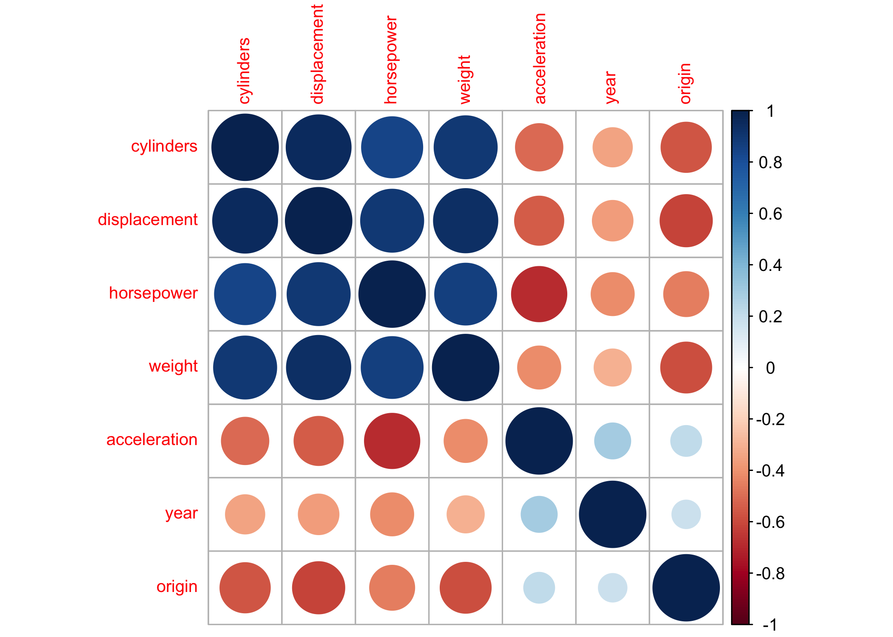

P8106 HW3
================
Lin Yang

``` r
library(tidyverse)
library(caret)
library(glmnet)
library(mlbench)
library(pROC)
library(pdp)
library(vip)
library(AppliedPredictiveModeling)
```

## Partition the dataset into training data and test data

``` r
auto <- read.csv("data/auto.csv") %>% 
  janitor::clean_names() %>% 
  na.omit() %>% 
  mutate(mpg_cat = factor(mpg_cat, levels = c("low", "high")))

set.seed(2022)
trainRows <- createDataPartition(y = auto$mpg_cat, p = 0.7, list = FALSE)
auto_train <- auto[trainRows, ]
auto_test <- auto[-trainRows, ]
```

## EDA

The numeric summary of all variables is shown below. This auto dataset
contains 392 observations of 8 variables. The response variable is
`mpg_cat` and predictors are cylinders, displacement, horsepower,
weight, acceleration, year, origin.

``` r
summary(auto)
```

    ##    cylinders      displacement     horsepower        weight      acceleration  
    ##  Min.   :3.000   Min.   : 68.0   Min.   : 46.0   Min.   :1613   Min.   : 8.00  
    ##  1st Qu.:4.000   1st Qu.:105.0   1st Qu.: 75.0   1st Qu.:2225   1st Qu.:13.78  
    ##  Median :4.000   Median :151.0   Median : 93.5   Median :2804   Median :15.50  
    ##  Mean   :5.472   Mean   :194.4   Mean   :104.5   Mean   :2978   Mean   :15.54  
    ##  3rd Qu.:8.000   3rd Qu.:275.8   3rd Qu.:126.0   3rd Qu.:3615   3rd Qu.:17.02  
    ##  Max.   :8.000   Max.   :455.0   Max.   :230.0   Max.   :5140   Max.   :24.80  
    ##       year           origin      mpg_cat   
    ##  Min.   :70.00   Min.   :1.000   low :196  
    ##  1st Qu.:73.00   1st Qu.:1.000   high:196  
    ##  Median :76.00   Median :1.000             
    ##  Mean   :75.98   Mean   :1.577             
    ##  3rd Qu.:79.00   3rd Qu.:2.000             
    ##  Max.   :82.00   Max.   :3.000

``` r
theme1 <- transparentTheme(trans = .4) #transparent level
trellis.par.set(theme1)

featurePlot(x = auto[, 1:7], 
            y = auto$mpg_cat,
            scales = list(x = list(relation = "free"), 
                          y = list(relation = "free")),
            plot = "density", pch = "|", 
            auto.key = list(columns = 2))
```

<!-- -->

``` r
#correlation plot of predictors
corrplot::corrplot(cor(auto[, 1:7]), 
         method = "circle", 
         type = "full",
         tl.cex = 0.8)
```

<!-- -->

Based on the density plot of response vs. predictors, some predictors
have quite different density plots, such as `year`, `cylinders`,
`displacement`, `horsepower`, and `weight`. This means these predictors
are more informative in making predictions of response variable. For
example, cars with larger weights tend to have low gas mileage. From the
correlation plot, we can see that some variables are highly correlated.
For example, `weight` is positively correlated with `displacement`, and
`acceleration` is negatively correlated with `horsepower`.

## Logistic regression

``` r
contrasts(auto$mpg_cat)
```

    ##      high
    ## low     0
    ## high    1

``` r
fit.glm <- glm(mpg_cat ~ ., 
               data = auto, 
               subset = trainRows, 
               family = binomial(link = "logit"))
summary(fit.glm)
```

    ## 
    ## Call:
    ## glm(formula = mpg_cat ~ ., family = binomial(link = "logit"), 
    ##     data = auto, subset = trainRows)
    ## 
    ## Deviance Residuals: 
    ##      Min        1Q    Median        3Q       Max  
    ## -2.55072  -0.08277   0.00712   0.19161   2.94817  
    ## 
    ## Coefficients:
    ##                Estimate Std. Error z value Pr(>|z|)    
    ## (Intercept)  -2.660e+01  7.678e+00  -3.464 0.000531 ***
    ## cylinders     3.140e-01  5.414e-01   0.580 0.561890    
    ## displacement -6.976e-04  1.663e-02  -0.042 0.966542    
    ## horsepower   -1.595e-02  2.918e-02  -0.547 0.584561    
    ## weight       -5.607e-03  1.581e-03  -3.546 0.000392 ***
    ## acceleration  1.236e-01  1.629e-01   0.758 0.448303    
    ## year          5.200e-01  1.045e-01   4.975 6.53e-07 ***
    ## origin        6.247e-01  4.738e-01   1.319 0.187319    
    ## ---
    ## Signif. codes:  0 '***' 0.001 '**' 0.01 '*' 0.05 '.' 0.1 ' ' 1
    ## 
    ## (Dispersion parameter for binomial family taken to be 1)
    ## 
    ##     Null deviance: 382.62  on 275  degrees of freedom
    ## Residual deviance: 100.90  on 268  degrees of freedom
    ## AIC: 116.9
    ## 
    ## Number of Fisher Scoring iterations: 8

``` r
vip(fit.glm)
```

<!-- -->

According to the variable importance plot, `year` and `weight` have the
largest variable importance scores, which corresponds to their smallest
p-values in the model summary. They both have p-values less than 0.05,
indicating that they are statistically significant predictors. Also, the
decreasing order of variable importance scores matches the increasing
order of p-values.

``` r
test.pred.prob <- predict(fit.glm, 
                          newdata = auto_test,
                          type = "response")
test.pred <- rep("low", length(test.pred.prob))
#consider a simple classifier with a cut-off of 0.5 here
test.pred[test.pred.prob > 0.5] <- "high"

confusionMatrix(data = factor(test.pred, levels = c("low", "high")),
                reference = auto_test$mpg_cat,
                positive = "high")
```

    ## Confusion Matrix and Statistics
    ## 
    ##           Reference
    ## Prediction low high
    ##       low   49    7
    ##       high   9   51
    ##                                           
    ##                Accuracy : 0.8621          
    ##                  95% CI : (0.7857, 0.9191)
    ##     No Information Rate : 0.5             
    ##     P-Value [Acc > NIR] : 2.479e-16       
    ##                                           
    ##                   Kappa : 0.7241          
    ##                                           
    ##  Mcnemar's Test P-Value : 0.8026          
    ##                                           
    ##             Sensitivity : 0.8793          
    ##             Specificity : 0.8448          
    ##          Pos Pred Value : 0.8500          
    ##          Neg Pred Value : 0.8750          
    ##              Prevalence : 0.5000          
    ##          Detection Rate : 0.4397          
    ##    Detection Prevalence : 0.5172          
    ##       Balanced Accuracy : 0.8621          
    ##                                           
    ##        'Positive' Class : high            
    ## 

When using the logistic regression model to make predictions on the test
data, the confusion matrix suggests that the overall prediction accuracy
is 0.8621 with a 95% CI of (0.7857, 0.9191). The no information rate is
0.5, meaning if we have no information and predict all observations to
either low or high class, the accuracy would be 50%. The extremely small
p value suggests that the accuracy is significantly better than the no
information rate. The kappa is 0.7241, greater than 0.6, meaning our
classifier performs better as compared to how well it would have
performed simply by chance. The sensitivity and specificity of this
model are 0.8793 and 0.8448 which are both quite high. PPV (0.85) and
NPV (0.875) are also good.

We then use `caret` to fit a logistic regression model and to compare
the cv performance with other models.

``` r
ctrl <- trainControl(method = "repeatedcv",
                     summaryFunction = twoClassSummary,
                     classProbs = TRUE)
set.seed(2022)
model.glm <- train(x = auto_train[1:7],
                   y = auto_train$mpg_cat,
                   method = "glm",
                   metric = "ROC",
                   trControl = ctrl)
```
