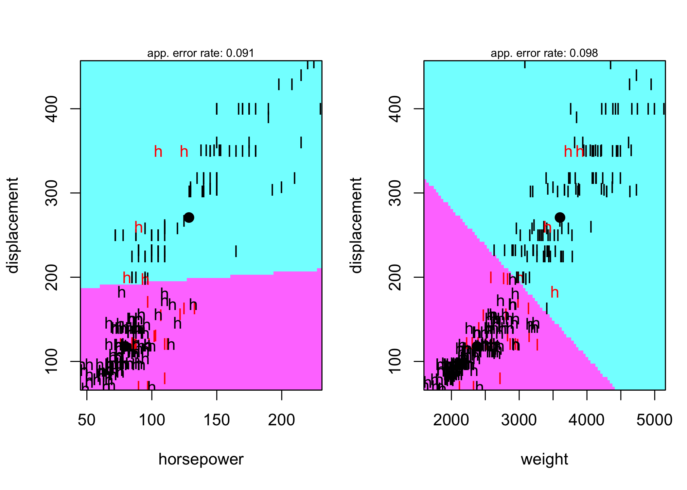

P8106 HW3
================
Lin Yang

``` r
library(tidyverse)
library(caret)
library(glmnet)
library(mlbench)
library(pROC)
library(klaR)
library(pdp)
library(vip)
library(MASS)
library(AppliedPredictiveModeling)
```

## Partition the dataset into training data and test data

``` r
auto <- read.csv("data/auto.csv") %>% 
  janitor::clean_names() %>% 
  na.omit() %>% 
  mutate(cylinders = as.factor(cylinders),
         year = as.factor(year),
         origin = as.factor(origin),
         mpg_cat = factor(mpg_cat, levels = c("low", "high")))

set.seed(1)
trainRows <- createDataPartition(y = auto$mpg_cat, p = 0.7, list = FALSE)
auto_train <- auto[trainRows, ]
auto_test <- auto[-trainRows, ]
```

## EDA

The numeric summary of all variables is shown below. This auto dataset
contains 392 observations of 8 variables. The response variable is
`mpg_cat` and predictors are cylinders, displacement, horsepower,
weight, acceleration, year, origin.

``` r
summary(auto)
```

    ##  cylinders  displacement     horsepower        weight      acceleration  
    ##  3:  4     Min.   : 68.0   Min.   : 46.0   Min.   :1613   Min.   : 8.00  
    ##  4:199     1st Qu.:105.0   1st Qu.: 75.0   1st Qu.:2225   1st Qu.:13.78  
    ##  5:  3     Median :151.0   Median : 93.5   Median :2804   Median :15.50  
    ##  6: 83     Mean   :194.4   Mean   :104.5   Mean   :2978   Mean   :15.54  
    ##  8:103     3rd Qu.:275.8   3rd Qu.:126.0   3rd Qu.:3615   3rd Qu.:17.02  
    ##            Max.   :455.0   Max.   :230.0   Max.   :5140   Max.   :24.80  
    ##                                                                          
    ##       year     origin  mpg_cat   
    ##  73     : 40   1:245   low :196  
    ##  78     : 36   2: 68   high:196  
    ##  76     : 34   3: 79             
    ##  75     : 30                     
    ##  82     : 30                     
    ##  70     : 29                     
    ##  (Other):193

``` r
theme1 <- transparentTheme(trans = .4)
trellis.par.set(theme1)

#feature plots of continuous variables
auto_con <- auto %>% dplyr::select(displacement, horsepower, weight, acceleration, mpg_cat)
featurePlot(x = auto_con[, 1:4], 
            y = auto_con$mpg_cat,
            scales = list(x = list(relation = "free"), 
                          y = list(relation = "free")),
            plot = "density", pch = "|", 
            auto.key = list(columns = 2))
```

<!-- -->

Based on the density plot of response vs. continuous predictors, some
predictors have quite different density plots, such as `displacement`,
`horsepower`, and `weight`. This means these predictors are more
informative in making predictions of response variable. For example,
cars with larger weights tend to have low gas mileage.

We then make a LDA-based partition plot using continuous variables that
are informative according to the density plot above.

``` r
partimat(mpg_cat ~ displacement + horsepower + weight, 
         data = auto, 
         subset = trainRows,
         method = "lda")
```

<!-- --><!-- -->

The partition plots are based on every combination of two variables. `h`
represents high gas mileage, `l` represents low mileage. The decision
boundary is shown on each plot, and red data points represent
mis-classification. The combination of displacement and horsepower has
the lowest error rate, 0.087.

``` r
#correlation plot of predictors
auto1 <- read.csv("data/auto.csv") %>% 
  janitor::clean_names() %>% 
  na.omit()
corrplot::corrplot(cor(auto1[1:7]), 
         method = "circle", 
         type = "full",
         tl.cex = 0.8)
```

<!-- -->

From the correlation plot, we can see that some variables are highly
correlated. For example, `weight` is positively correlated with
`displacement`, and `acceleration` is negatively correlated with
`horsepower`.

## Logistic regression

``` r
contrasts(auto$mpg_cat)
```

    ##      high
    ## low     0
    ## high    1

``` r
fit.glm <- glm(mpg_cat ~ ., 
               data = auto, 
               subset = trainRows, 
               family = binomial(link = "logit"))
summary(fit.glm)
```

    ## 
    ## Call:
    ## glm(formula = mpg_cat ~ ., family = binomial(link = "logit"), 
    ##     data = auto, subset = trainRows)
    ## 
    ## Deviance Residuals: 
    ##     Min       1Q   Median       3Q      Max  
    ## -1.9453  -0.0344   0.0000   0.0116   3.4974  
    ## 
    ## Coefficients:
    ##                Estimate Std. Error z value Pr(>|z|)   
    ## (Intercept)   1.917e+01  9.727e+00   1.971  0.04874 * 
    ## cylinders4    1.146e+01  4.133e+00   2.773  0.00556 **
    ## cylinders5    1.056e+01  4.659e+00   2.266  0.02343 * 
    ## cylinders6    6.695e+00  3.959e+00   1.691  0.09079 . 
    ## cylinders8    1.220e+01  5.389e+00   2.263  0.02363 * 
    ## displacement  1.763e-02  2.501e-02   0.705  0.48086   
    ## horsepower   -1.317e-01  6.437e-02  -2.046  0.04080 * 
    ## weight       -6.143e-03  2.941e-03  -2.088  0.03676 * 
    ## acceleration -2.191e-01  3.511e-01  -0.624  0.53252   
    ## year71       -7.866e-01  3.573e+00  -0.220  0.82576   
    ## year72       -4.829e+00  2.078e+00  -2.323  0.02016 * 
    ## year73       -1.618e+00  2.305e+00  -0.702  0.48270   
    ## year74        4.546e-01  5.102e+00   0.089  0.92899   
    ## year75        7.168e-01  1.883e+00   0.381  0.70340   
    ## year76        2.198e+00  2.352e+00   0.935  0.34997   
    ## year77       -5.362e-01  2.284e+00  -0.235  0.81436   
    ## year78        7.792e-02  2.379e+00   0.033  0.97387   
    ## year79        4.322e+00  2.413e+00   1.792  0.07320 . 
    ## year80        5.317e+00  2.962e+00   1.795  0.07262 . 
    ## year81        5.313e+00  2.256e+00   2.355  0.01851 * 
    ## year82        2.301e+01  1.712e+03   0.013  0.98928   
    ## origin2       6.362e-01  1.529e+00   0.416  0.67736   
    ## origin3       7.052e+00  3.123e+00   2.258  0.02392 * 
    ## ---
    ## Signif. codes:  0 '***' 0.001 '**' 0.01 '*' 0.05 '.' 0.1 ' ' 1
    ## 
    ## (Dispersion parameter for binomial family taken to be 1)
    ## 
    ##     Null deviance: 382.617  on 275  degrees of freedom
    ## Residual deviance:  51.724  on 253  degrees of freedom
    ## AIC: 97.724
    ## 
    ## Number of Fisher Scoring iterations: 18

``` r
vip(fit.glm)
```

<!-- -->

According to the variable importance plot, `weight`, `year81`, and
`year79` have the largest variable importance scores, which corresponds
to their smallest p-values in the model summary. Their p-values are less
than 0.05, indicating that they are statistically significant predictor.
Also, the decreasing order of variable importance scores matches the
increasing order of p-values.

``` r
test.pred.prob <- predict(fit.glm, 
                          newdata = auto_test,
                          type = "response")
test.pred <- rep("low", length(test.pred.prob))
#consider a simple classifier with a cut-off of 0.5 here
test.pred[test.pred.prob > 0.5] <- "high"

confusionMatrix(data = factor(test.pred, levels = c("low", "high")),
                reference = auto_test$mpg_cat,
                positive = "high")
```

    ## Confusion Matrix and Statistics
    ## 
    ##           Reference
    ## Prediction low high
    ##       low   48    4
    ##       high  10   54
    ##                                           
    ##                Accuracy : 0.8793          
    ##                  95% CI : (0.8058, 0.9324)
    ##     No Information Rate : 0.5             
    ##     P-Value [Acc > NIR] : <2e-16          
    ##                                           
    ##                   Kappa : 0.7586          
    ##                                           
    ##  Mcnemar's Test P-Value : 0.1814          
    ##                                           
    ##             Sensitivity : 0.9310          
    ##             Specificity : 0.8276          
    ##          Pos Pred Value : 0.8438          
    ##          Neg Pred Value : 0.9231          
    ##              Prevalence : 0.5000          
    ##          Detection Rate : 0.4655          
    ##    Detection Prevalence : 0.5517          
    ##       Balanced Accuracy : 0.8793          
    ##                                           
    ##        'Positive' Class : high            
    ## 

When using the logistic regression model to make predictions on the test
data, the confusion matrix suggests that the overall prediction accuracy
is 0.9052 with a 95% CI of (0.8367, 0.9517). The no information rate is
0.5, meaning if we have no information and predict all observations to
either low or high class, the accuracy would be 50%. The extremely small
p value suggests that the accuracy is significantly better than the no
information rate. The kappa is 0.8103, greater than 0.8, meaning our
classifier performs better as compared to how well it would have
performed simply by chance. The sensitivity and specificity of this
model are 0.9483 and 0.8621 which are both quite high. PPV (0.873) and
NPV (0.9434) are also good.

We then use `caret` to fit a logistic regression model and to compare
the cv performance with other models.

``` r
ctrl <- trainControl(method = "repeatedcv",
                     repeats = 5,
                     summaryFunction = twoClassSummary,
                     classProbs = TRUE)
set.seed(1)
model.glm <- train(x = auto_train[1:7],
                   y = auto_train$mpg_cat,
                   method = "glm",
                   metric = "ROC",
                   trControl = ctrl)
```

## MARS

``` r
set.seed(1)
model.mars <- train(x = auto_train[1:7],
                    y = auto_train$mpg_cat,
                    method = "earth",
                    tuneGrid = expand.grid(degree = 1:3, 
                                           nprune = 2:20),
                    metric = "ROC",
                    trControl = ctrl)

plot(model.mars)
```

<!-- -->

``` r
model.mars$bestTune
```

    ##   nprune degree
    ## 5      6      1

``` r
coef(model.mars$finalModel) 
```

    ##         (Intercept)          cylinders4 h(displacement-122) h(displacement-119) 
    ##          0.05375429          3.87064777          2.24316409         -1.95531921 
    ## h(displacement-146) h(displacement-200) 
    ##         -0.34929147          0.05172068

## LDA

``` r
fit.lda <- lda(mpg_cat~., 
               data = auto,
               subset = trainRows)

plot(fit.lda)
```

<!-- -->

``` r
mean(predict(fit.lda)$x)
```

    ## [1] -1.710211e-17

``` r
lda.pred <- predict(fit.lda, newdata = auto_test)
head(lda.pred$posterior)
```

    ##         low         high
    ## 2 0.9992804 7.196043e-04
    ## 3 0.9983461 1.653852e-03
    ## 4 0.9979290 2.070988e-03
    ## 5 0.9982497 1.750291e-03
    ## 6 0.9999292 7.082819e-05
    ## 8 0.9999364 6.361540e-05

The average LD1 is almost 0, indicating that linear discriminant
variables have been centered. The histograms of transformed x shows that
data points with negative transformed x values tend to be classified
into the low group, on the other hand, data points with positive x
values tend to be classified into the high group. The decision boundary
is approximately at x = 0.

``` r
set.seed(1)
model.lda <- train(mpg_cat ~ .,
                   data = auto_train,
                   method = "lda",
                   metric = "ROC",
                   trControl = ctrl)
```

## Model comparison

``` r
res <- resamples(list(glm = model.glm, mars = model.mars, lda = model.lda))
summary(res)
```

    ## 
    ## Call:
    ## summary.resamples(object = res)
    ## 
    ## Models: glm, mars, lda 
    ## Number of resamples: 50 
    ## 
    ## ROC 
    ##           Min.   1st Qu.    Median      Mean   3rd Qu. Max. NA's
    ## glm  0.8520408 0.9389717 0.9752747 0.9625740 0.9947998    1    0
    ## mars 0.8431953 0.9244505 0.9656593 0.9532493 0.9948980    1    0
    ## lda  0.8724490 0.9649725 0.9841052 0.9740255 1.0000000    1    0
    ## 
    ## Sens 
    ##           Min.   1st Qu.    Median      Mean   3rd Qu. Max. NA's
    ## glm  0.5714286 0.8571429 0.9285714 0.9016484 0.9285714    1    0
    ## mars 0.7142857 0.8571429 0.9285714 0.9117582 1.0000000    1    0
    ## lda  0.7142857 0.8571429 0.9285714 0.9132967 1.0000000    1    0
    ## 
    ## Spec 
    ##           Min.   1st Qu.    Median      Mean   3rd Qu. Max. NA's
    ## glm  0.7142857 0.8571429 0.9285714 0.9150549 1.0000000    1    0
    ## mars 0.6428571 0.8461538 0.8901099 0.8814286 0.9821429    1    0
    ## lda  0.6428571 0.8571429 0.9285714 0.9061538 1.0000000    1    0

``` r
bwplot(res, metric = "ROC")
```

<!-- -->

Based on the ROC summary and boxplots, the LDA model has the highest
AUC, thus it is used to predict the response variable. We then plot its
ROC curve using the test data, the AUC is 0.955 and misclassification
error rate is 1 - 0.8966 = 10.34%.

``` r
lda.pred <- predict(model.lda, newdata = auto_test, type = "prob")[,2]
roc.lda <- roc(auto_test$mpg_cat, lda.pred)
auc <- roc.lda$auc[1]
auc
```

    ## [1] 0.955113

``` r
plot(roc.lda, legacy.axes = TRUE)
legend("bottomright", legend = paste0("lda", ": ", round(auc, 3)), cex = 1)
```

<!-- -->

``` r
lda.pred.prob <- predict(model.lda,
                         newdata = auto_test,
                         type = "prob")
lda.pred <- rep("low", nrow(lda.pred.prob))
#consider a simple classifier with a cut-off of 0.5 here
lda.pred[lda.pred.prob[2] > 0.5] <- "high"

confusionMatrix(data = factor(lda.pred, levels = c("low", "high")),
                reference = auto_test$mpg_cat,
                positive = "high")
```

    ## Confusion Matrix and Statistics
    ## 
    ##           Reference
    ## Prediction low high
    ##       low   49    3
    ##       high   9   55
    ##                                           
    ##                Accuracy : 0.8966          
    ##                  95% CI : (0.8263, 0.9454)
    ##     No Information Rate : 0.5             
    ##     P-Value [Acc > NIR] : <2e-16          
    ##                                           
    ##                   Kappa : 0.7931          
    ##                                           
    ##  Mcnemar's Test P-Value : 0.1489          
    ##                                           
    ##             Sensitivity : 0.9483          
    ##             Specificity : 0.8448          
    ##          Pos Pred Value : 0.8594          
    ##          Neg Pred Value : 0.9423          
    ##              Prevalence : 0.5000          
    ##          Detection Rate : 0.4741          
    ##    Detection Prevalence : 0.5517          
    ##       Balanced Accuracy : 0.8966          
    ##                                           
    ##        'Positive' Class : high            
    ## 
