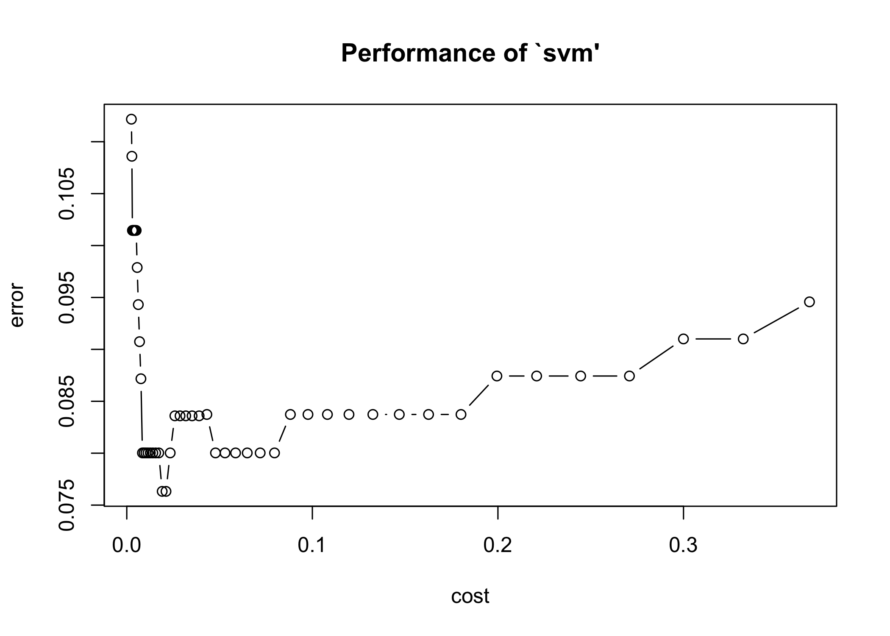
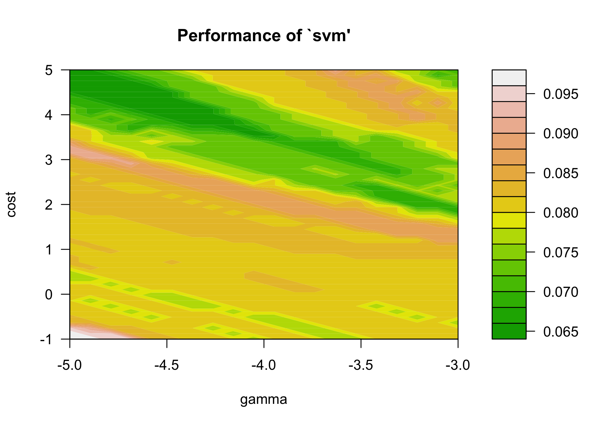

P8106 HW5
================
Lin Yang

``` r
library(tidyverse)
library(caret)
library(e1071)
library(kernlab)
```

## Problem 11

``` r
auto <- read.csv("data/auto.csv") %>% 
  janitor::clean_names() %>% 
  na.omit() %>% 
  mutate(origin = as.factor(origin),
         mpg_cat = factor(mpg_cat, levels = c("low", "high")))
str(auto)
```

    ## 'data.frame':    392 obs. of  8 variables:
    ##  $ cylinders   : int  8 8 8 8 8 8 8 8 8 8 ...
    ##  $ displacement: num  307 350 318 304 302 429 454 440 455 390 ...
    ##  $ horsepower  : int  130 165 150 150 140 198 220 215 225 190 ...
    ##  $ weight      : int  3504 3693 3436 3433 3449 4341 4354 4312 4425 3850 ...
    ##  $ acceleration: num  12 11.5 11 12 10.5 10 9 8.5 10 8.5 ...
    ##  $ year        : int  70 70 70 70 70 70 70 70 70 70 ...
    ##  $ origin      : Factor w/ 3 levels "1","2","3": 1 1 1 1 1 1 1 1 1 1 ...
    ##  $ mpg_cat     : Factor w/ 2 levels "low","high": 1 1 1 1 1 1 1 1 1 1 ...

``` r
set.seed(2022)
trainRows <- createDataPartition(y = auto$mpg_cat, p = 0.7, list = FALSE)
auto_train <- auto[trainRows, ]
auto_test <- auto[-trainRows, ]
```

### (a) Support Vector Classifier (linear kernel)

``` r
set.seed(2022)
linear.tune <- tune.svm(mpg_cat ~ . , 
                        data = auto_train, 
                        kernel = "linear", 
                        cost = exp(seq(-6, -1, len = 50)),
                        scale = TRUE)
plot(linear.tune)
```

<!-- -->

``` r
best.linear <- linear.tune$best.model
summary(best.linear)
```

    ## 
    ## Call:
    ## best.svm(x = mpg_cat ~ ., data = auto_train, cost = exp(seq(-6, -1, 
    ##     len = 50)), kernel = "linear", scale = TRUE)
    ## 
    ## 
    ## Parameters:
    ##    SVM-Type:  C-classification 
    ##  SVM-Kernel:  linear 
    ##        cost:  0.01907868 
    ## 
    ## Number of Support Vectors:  107
    ## 
    ##  ( 53 54 )
    ## 
    ## 
    ## Number of Classes:  2 
    ## 
    ## Levels: 
    ##  low high

Through 10-fold CV, the best tuning parameter (cost) of the support
vector classifier is selected to be 0.019. There are 107 support vectors
in the optimal support vector classifier with a linear kernel (53 from
the low gas mileage level, 54 from the high mileage level). The training
and test error rates are found to be 7.61% (1-0.9239 ) and 9.48%
(1-0.9052).

``` r
#train error
pred.linear.train <- predict(best.linear, newdata = auto_train)
confusionMatrix(data = pred.linear.train, 
                reference = auto_train$mpg_cat,
                positive = "high")
```

    ## Confusion Matrix and Statistics
    ## 
    ##           Reference
    ## Prediction low high
    ##       low  120    3
    ##       high  18  135
    ##                                          
    ##                Accuracy : 0.9239         
    ##                  95% CI : (0.886, 0.9523)
    ##     No Information Rate : 0.5            
    ##     P-Value [Acc > NIR] : < 2e-16        
    ##                                          
    ##                   Kappa : 0.8478         
    ##                                          
    ##  Mcnemar's Test P-Value : 0.00225        
    ##                                          
    ##             Sensitivity : 0.9783         
    ##             Specificity : 0.8696         
    ##          Pos Pred Value : 0.8824         
    ##          Neg Pred Value : 0.9756         
    ##              Prevalence : 0.5000         
    ##          Detection Rate : 0.4891         
    ##    Detection Prevalence : 0.5543         
    ##       Balanced Accuracy : 0.9239         
    ##                                          
    ##        'Positive' Class : high           
    ## 

``` r
#test error
pred.linear.test <- predict(best.linear, newdata = auto_test)
confusionMatrix(data = pred.linear.test, 
                reference = auto_test$mpg_cat,
                positive = "high")
```

    ## Confusion Matrix and Statistics
    ## 
    ##           Reference
    ## Prediction low high
    ##       low   50    3
    ##       high   8   55
    ##                                           
    ##                Accuracy : 0.9052          
    ##                  95% CI : (0.8367, 0.9517)
    ##     No Information Rate : 0.5             
    ##     P-Value [Acc > NIR] : <2e-16          
    ##                                           
    ##                   Kappa : 0.8103          
    ##                                           
    ##  Mcnemar's Test P-Value : 0.2278          
    ##                                           
    ##             Sensitivity : 0.9483          
    ##             Specificity : 0.8621          
    ##          Pos Pred Value : 0.8730          
    ##          Neg Pred Value : 0.9434          
    ##              Prevalence : 0.5000          
    ##          Detection Rate : 0.4741          
    ##    Detection Prevalence : 0.5431          
    ##       Balanced Accuracy : 0.9052          
    ##                                           
    ##        'Positive' Class : high            
    ## 

### (b) Support Vector Machine (radial kernel)

``` r
set.seed(2022)
radial.tune <- tune.svm(mpg_cat ~ . , 
                        data = auto_train, 
                        kernel = "radial", 
                        cost = exp(seq(-1, 5, len = 50)),
                        gamma = exp(seq(-5, -3, len = 20)))

plot(radial.tune, transform.y = log, transform.x = log, 
     color.palette = terrain.colors)
```

<!-- -->

``` r
best.radial <- radial.tune$best.model
summary(best.radial)
```

    ## 
    ## Call:
    ## best.svm(x = mpg_cat ~ ., data = auto_train, gamma = exp(seq(-5, 
    ##     -3, len = 20)), cost = exp(seq(-1, 5, len = 50)), kernel = "radial")
    ## 
    ## 
    ## Parameters:
    ##    SVM-Type:  C-classification 
    ##  SVM-Kernel:  radial 
    ##        cost:  34.14487 
    ## 
    ## Number of Support Vectors:  59
    ## 
    ##  ( 29 30 )
    ## 
    ## 
    ## Number of Classes:  2 
    ## 
    ## Levels: 
    ##  low high

``` r
radial.tune$best.parameters
```

    ##          gamma     cost
    ## 750 0.01737659 34.14487

Through 10-fold CV, the best tuning parameters (cost and gamma) of the
support vector machine are selected to be 0.0174 and 34.14. There are 59
support vectors in the optimal support vector machine with a radial
kernel (29 from the low gas mileage level, 30 from the high mileage
level). The training and test error rates are found to be 6.16%
(1-0.9384) and 9.48% (1-0.9052). The optimal support vector machine
performs slightly better than the optimal support vector classifier in
terms of the train errors. However, they have the same test error rates.

``` r
#train error
pred.radial.train <- predict(best.radial, newdata = auto_train)
confusionMatrix(data = pred.radial.train, 
                reference = auto_train$mpg_cat,
                positive = "high")
```

    ## Confusion Matrix and Statistics
    ## 
    ##           Reference
    ## Prediction low high
    ##       low  126    5
    ##       high  12  133
    ##                                           
    ##                Accuracy : 0.9384          
    ##                  95% CI : (0.9032, 0.9637)
    ##     No Information Rate : 0.5             
    ##     P-Value [Acc > NIR] : <2e-16          
    ##                                           
    ##                   Kappa : 0.8768          
    ##                                           
    ##  Mcnemar's Test P-Value : 0.1456          
    ##                                           
    ##             Sensitivity : 0.9638          
    ##             Specificity : 0.9130          
    ##          Pos Pred Value : 0.9172          
    ##          Neg Pred Value : 0.9618          
    ##              Prevalence : 0.5000          
    ##          Detection Rate : 0.4819          
    ##    Detection Prevalence : 0.5254          
    ##       Balanced Accuracy : 0.9384          
    ##                                           
    ##        'Positive' Class : high            
    ## 

``` r
#test error
pred.radial.test <- predict(best.radial, newdata = auto_test)
confusionMatrix(data = pred.radial.test, 
                reference = auto_test$mpg_cat,
                positive = "high")
```

    ## Confusion Matrix and Statistics
    ## 
    ##           Reference
    ## Prediction low high
    ##       low   51    4
    ##       high   7   54
    ##                                           
    ##                Accuracy : 0.9052          
    ##                  95% CI : (0.8367, 0.9517)
    ##     No Information Rate : 0.5             
    ##     P-Value [Acc > NIR] : <2e-16          
    ##                                           
    ##                   Kappa : 0.8103          
    ##                                           
    ##  Mcnemar's Test P-Value : 0.5465          
    ##                                           
    ##             Sensitivity : 0.9310          
    ##             Specificity : 0.8793          
    ##          Pos Pred Value : 0.8852          
    ##          Neg Pred Value : 0.9273          
    ##              Prevalence : 0.5000          
    ##          Detection Rate : 0.4655          
    ##    Detection Prevalence : 0.5259          
    ##       Balanced Accuracy : 0.9052          
    ##                                           
    ##        'Positive' Class : high            
    ## 
